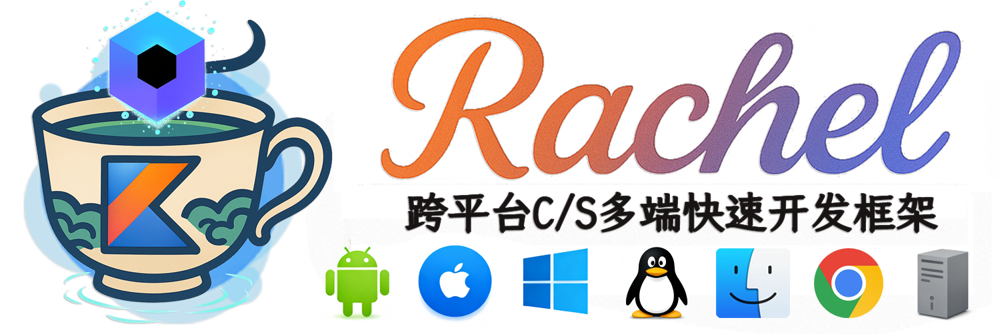
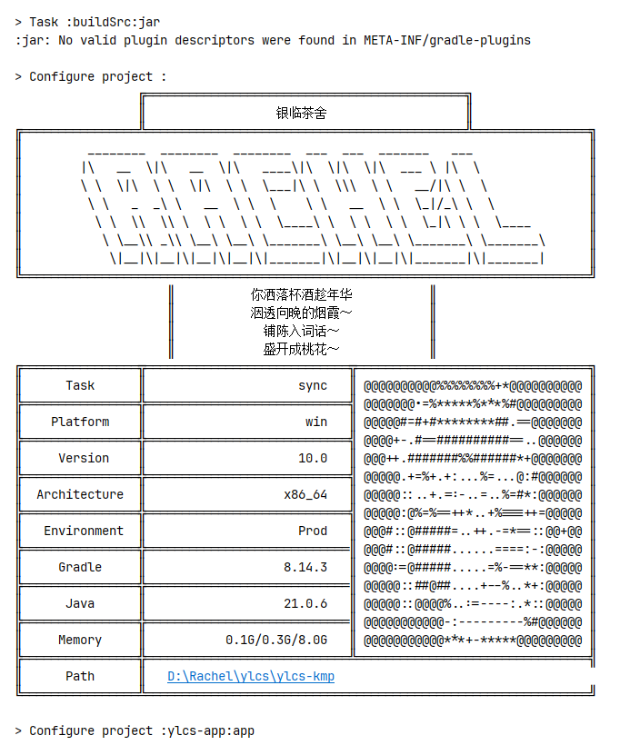

<div>
    <h5></h5>
    <div>
        
        
        
        
        
        
    </div>
    <h5></h5>
    <div>
        
        
        
        
    </div>
    <h5></h5>
</div>

# Rachel快速开发框架

`Rachel`是基于`Kotlin Multiplatform`与`Compose Multiplatform`集成逻辑、服务、UI的跨平台快速开发框架，
支持`Android`，`iOS`, `Windows`, `Linux`, `macOS`, `Web(wasm)`等客户端, `Server`服务端，
由银临茶舍项目组完成开发。

`Rachel` is cross-platform rapid development framework that integrates logic, services, and UI based on `Kotlin Multiplatform` and `Compose Multiplatform`.
It supports `Android`, `iOS`, `Windows`, `Linux`, `macOS`, `Web(wasm)` and other client and server platforms, and was developed by the 银临茶舍 project team.

## 特性

- **跨平台**：基于Kotlin Multiplatform / Compose Multiplatform，支持六个平台客户端与服务端，具有多端一致性。
- **原生性能**：生成平台原生二进制文件，无桥接或附加库。
- **单一语言**：仅需掌握`kotlin`语言即可完成大多数任务需求与开发。
- **快速**：三分钟便能上手构建自己的跨平台应用程序。
- **简洁**：大量类型安全与结构化的框架DSL，无需编写过多样板代码。
- **模块化**：全框架模块化，模块间依赖清晰，应用程序按需引入模块。
- **高协作**：框架支持前后端协作开发，共享数据组织结构。


- **Cross platform**: Based on Kotlin Multiplatform/Compose Multiplatform, it supports six platform clients and servers, with multi terminal consistency.
- **Native performance**: Generate platform native binary files without bridging or additional libraries.
- **Single language**: Mastering `kotlin` language is sufficient to complete most task requirements and development.
- **Quick**: You can start building your own cross platform application in just three minutes.
- **Simple**: A large number of type safe and structured framework DSL, without the need to write too much template code.
- **Modularization**: The entire framework is modularized, with clear dependencies between modules, allowing applications to introduce modules as needed.
- **High Collaboration**: The framework supports front-end and back-end collaborative development, sharing data organizational structures.

## 环境

- `Gradle 9.1.0`
- `JDK 25`
- `IntelliJ IDEA 2025.3`
- `Xcode 16.3`
- `MSVC v145` | `g++ 13`
- `Windows 10 SDK` | `Windows 11 SDK`

## 快速开始

### First Rachel App

```kotlin

fun main() = MyApplicaiton().run()

class MyApplication : PlatformApplication<MyApplication>(mApp) {
    @Composable
    override fun Content() {
        Text("hello world!")
    }
}

private val mApp = LazyReference<RachelApplication>()
val app: RachelApplication by mApp

```

### Screen Pages and Navigation

```kotlin

class ScreenMain(manager: ScreenManager) : Screen(manager) {
    @Composable
    override fun Content() {
        PrimaryButton("go to greet page") {
            navigate(::ScreenGreet, "hello world!")
        }
    }
}

class ScreenGreet(manager: ScreenManager, message: String) : Screen(manager) {
    @Composable
    override fun Content() {
        Text(message)
        PrimaryButton("back to main page") {
            pop()
        }
    }
}

class MyApplication : PlatformApplication<MyApplication>() {
    @Composable
    override fun Content() {
        AppScreen<ScreenMain> {
            screen(::ScreenMain)
            screen(::ScreenGreet)
        }
    }
}

```

### Floating Component

```kotlin

class ScreenMain(manager: ScreenManager) : Screen(manager) {
    @Composable
    override fun Content() {
        PrimaryButton("open dialog") {
            val result = dialog.openSuspend()
            println("the input text is $result")
        }
        PrimaryButton("open sheet") {
            sheet.open()
        }
        PrimaryButton("open sheet") {
            // application floating tip
            slot.tip.warning("open the tip")
        }
    }

    // applicaiton dialog
    val dialog = FloatingDialogInput()
    
    // application side sheet
    val sheet = object : FloatingSheet() {
        @Composable
        override fun Content() {
            Text("from sheet")
        }
    }

    // application fab
    override val fabIcon: ImageVector = Icons.outlined.Submit

    override suspend fun onFabClick() {
        println("from fab button")
    }
    
    @Composable
    override fun Floating() {
        sheet.Land()
        dialog.Land()
    }
}

```

### Service Startup

```kotlin

// All services are automatically registered.
// Services can be accessed from any location globally
// Services can set priorities to resolve dependency relationships
// Services can be set to start synchronously or asynchronously
class MyApplication : PlatformApplication<MyApplication>() {
    // bind os service, then you can use os module functions and variables
    val os by system(::StartupOS)
    // bind picker service, then you can open native system dialog, pick the file, pick a photo...
    val picker by service(::StartupPicker)
    // bind config service, then you can read or write application config in disk
    val config by service(::StartupAppConfig)
    @Composable
    override fun Content() {
        PrimaryButton(text = os.storage.dataPath) {
            picker.pickPhoto()
        }
    }
}

```

### Client and Server

```kotlin

// Client and server code sharing, data structure sharing, one definition for two uses
// Dual end interface parameters and response types are secure, with fully automatic recognition
// Automatic construction of directory tree, no need to manually set paths

// Server resource
object ServerRes : ResNode("public") {
    object Activity : ResNode(this, "activity") {
        fun activity(uniqueId: String) = ResNode(this, "${uniqueId}.webp")
    }

    object Assets : ResNode(this, "assets") {
        val DefaultAvatar = ResNode(this, "default_avatar.webp")

        val DefaultWall = ResNode(this, "default_wall.webp")
    }

    val Server = ResNode(this, "server.json")
    val Update = ResNode(this, "update.json")
}

// public API for client and server
object API : APINode(null, "") {
    object User : APINode(this, "user") {
        object Profile : APINode(this, "profile") {
            object GetProfile : APIPost<String, UserProfile>(this, "getProfile")

            object UpdateName : APIPostRequest<UpdateName.Request>(this, "updateName") {
                @Serializable
                data class Request(val token: String, val name: String)
            }

            object UpdateAvatar : APIFormRequest<String, UpdateAvatar.Files>(this, "updateAvatar") {
                @Serializable
                data class Files(val avatar: APIFile)
            }

            object Signin : APIPostRequest<String>(this, "signin")
        }

        object Topic : APINode(this, "topic") {
            object GetTopics : APIPost<GetTopics.Request, List<love.yinlin.data.rachel.Topic>>(this, "getTopics") {
                @Serializable
                data class Request(val uid: Int, val isTop: Boolean = true, val offset: Int = Int.MAX_VALUE, val num: Int = APIConfig.MIN_PAGE_NUM)
            }
        }
    }
}

// client method

val result = ClientAPI.request(
    route = API.User.Mail.GetMails,
    data = API.User.Mail.GetMails.Request(
        token = config.userToken,
        offset = offset
    )
)

// server method

api(API.User.Topic.SendTopic) { (token, title, content, section), (pics) ->
    VN.throwEmpty(title, content)
    VN.throwSection(section)
    Data.Success(API.User.Topic.SendTopic.Response(tid, pic), "succeed")
}

```

## 文档

见

# 银临茶舍跨平台 App

> [!IMPORTANT]
>
>  基于`Rachel`框架开发的集资讯、听歌、美图、论坛、社交于一体的小银子聚集地应用程序
> 
>  银临茶舍水群：`828049503`


## 部署

### 编译

#### Common

git clone 源代码，Gradle 同步，等待下载依赖，完成构建。

所有模块输出均在 `output` 目录中。

#### Android

所属模块： `ylcs-app:app`

- 运行：`AndroidRun`
- 发布签名安装包：`androidPublish`

#### IOS

所属模块： `ylcs-app:app`

首先进入 iosApp 目录，执行 `pod install` 安装依赖。 然后使用 Xcode 直接运行或发布。

#### Desktop

先进入 native 目录，执行 `build.bat`(Windows) 或 `build.sh`(Linux/macOS) 脚本，会自动生成动态链接库文件到 native/libs 目录。

所属模块： `ylcs-app:app`

- 运行(Debug)：`desktopRunDebug`
- 运行(Release)：`desktopRunRelease`
- 输出依赖树：`dependencies`
- 检查模块完整性：`desktopCheckModules`
- 发布可执行文件：`desktopPublish`

#### Web

所属模块： `ylcs-app:app`

- 浏览器运行：`webRun`
- 发布网页：`webPublish`

#### Server

构建后运行会自动部署，将初始目录复制到当前目录下，可以直接运行或发布。

所属模块： `ylcs-app:server`

- 运行： `ServerDebug`
- 发布可执行文件：`serverPublish`

#### 分离环境

Redis 和 MySQL 配置可在 `resources` 中的 `config.properties` 配置
可选择本地调试（连接备用服务器）或生产环境部署（连接 `localhost`）

#### 更新

服务器 `resources` 下的如 `server.json` 类的文件只是初始配置文件，
当有变更时手动更新服务器文件，重启服务器即可，无需重新编译服务器代码。

**即每次更新只需要更换服务器 JAR 文件重启即可**

### 构建艺术



## Music模组协议

### MOD 核心模块 music

与 MOD 相关的模块为 music 和 modManager

music 模块是应用 MOD 存储协议及序列化与反序列化的核心实现, 被多平台客户端和 MOD 管理器调用

具体协议可参看 [Music 模组协议文档](ylcs-app/mod/mod.md)

### MOD 管理器 modManager

MOD 管理器是方便桌面客户端创建, 解析, 预览 MOD 的简易工具


## 贡献者

[](https://github.com/rachel-ylcs/ylcs-kmp/graphs/contributors)

## 许可

`银临茶舍KMP` 是在 MIT 许可下许可的开源软件，查看[LICENSE](LICENSE)获取更多信息。

## 致谢

按作者首字母排序。

|  Type   |     Author      |                                    Name                                     |
|:-------:|:---------------:|:---------------------------------------------------------------------------:|
| Library | alexzhirkevich  |          [compottie](https://github.com/alexzhirkevich/compottie)           |
| Library | alexzhirkevich  |              [qrose](https://github.com/alexzhirkevich/qrose)               |
| Library | brettwooldridge |           [HikariCP](https://github.com/brettwooldridge/HikariCP)           |
| Library |    Calvin-LL    |           [reorderable](https://github.com/Calvin-LL/Reorderable)           |
| Library |     caprica     |                   [vlcj](https://github.com/caprica/vlcj)                   |
| Library |   chrisbanes    |                 [haze](https://github.com/chrisbanes/haze)                  |
| Library |    fleeksoft    |                 [ksoup](https://github.com/fleeksoft/ksoup)                 |
| Library |     Google      |                 [media3](https://github.com/androidx/media)                 |
| Library |    jenly1314    |            [zxing-lite](https://github.com/jenly1314/ZXingLite)             |
| Library |    jenly1314    |           [camera-scan](https://github.com/jenly1314/CameraScan)            |
| Library |    Jetbrains    |                [kotlin](https://github.com/JetBrains/kotlin)                |
| Library |    Jetbrains    | [compose-multiplatform](https://github.com/JetBrains/compose-multiplatform) |
| Library |    Jetbrains    |                   [ktor](https://github.com/ktorio/ktor)                    |
| Library |     mlabbe      |       [nativefiledialog](https://github.com/mlabbe/nativefiledialog)        |
| Library |      mysql      |                       [mysql](https://dev.mysql.com)                        |
| Library |      panpf      |                  [sketch](https://github.com/panpf/sketch)                  |
| Library |     qos-ch      |                [logback](https://github.com/qos-ch/logback)                 |
| Library |      redis      |                   [jedis](https://github.com/redis/jedis)                   |
| Library |     Tencent     |                   [MMKV](https://github.com/Tencent/MMKV)                   |
| Library |     Tencent     |                 [libpag](https://github.com/Tencent/libpag)                 |