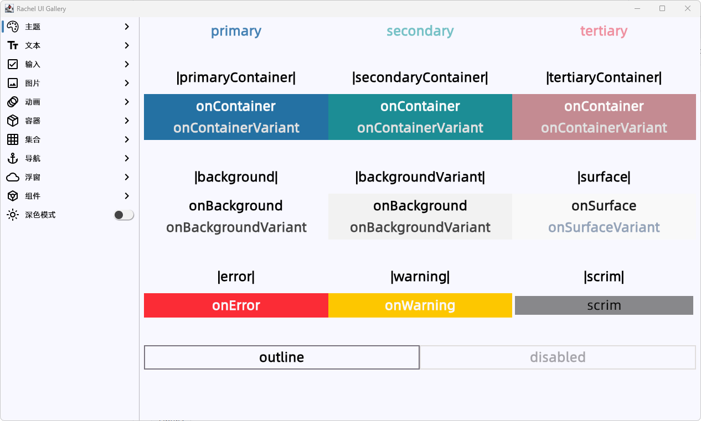
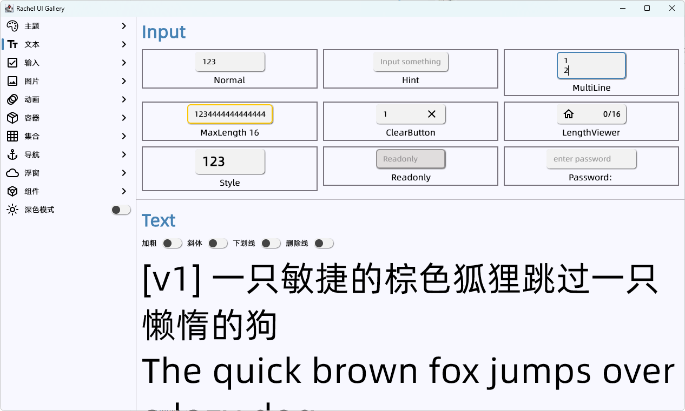
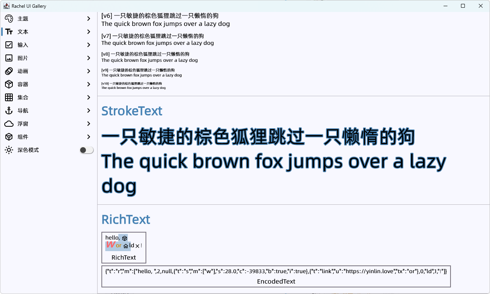
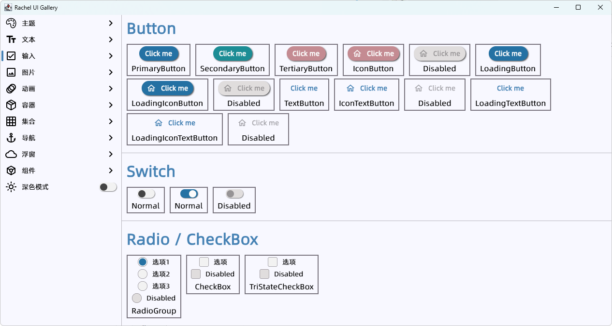
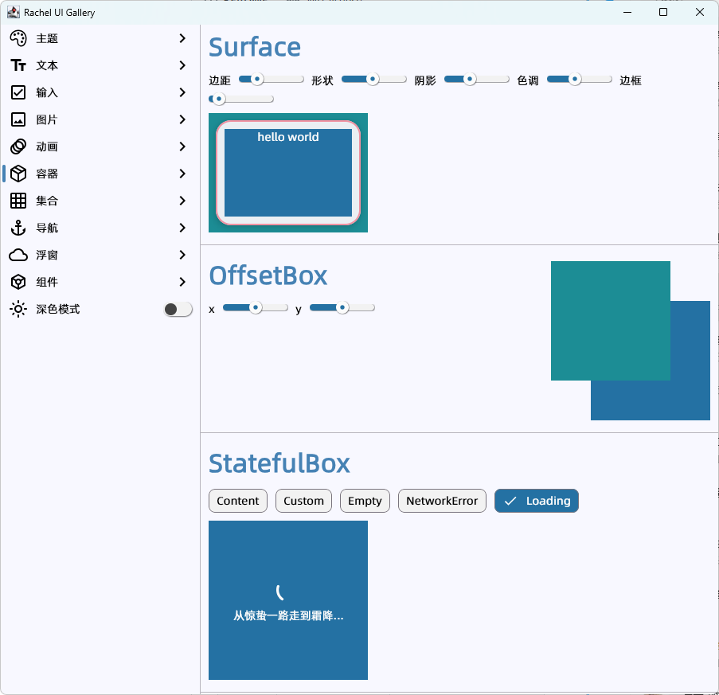
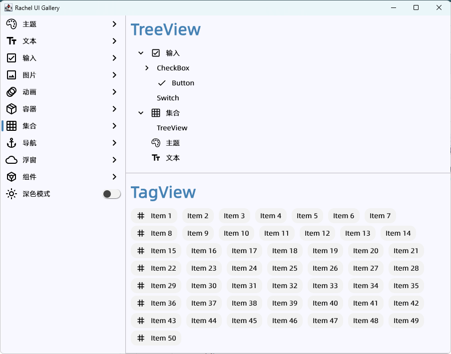
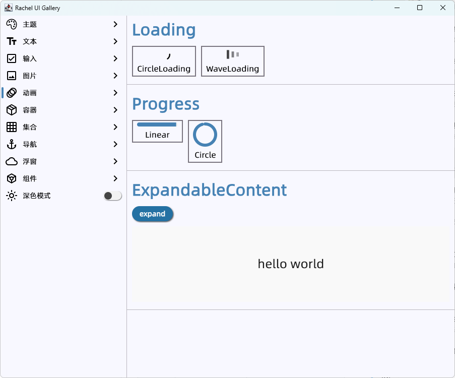
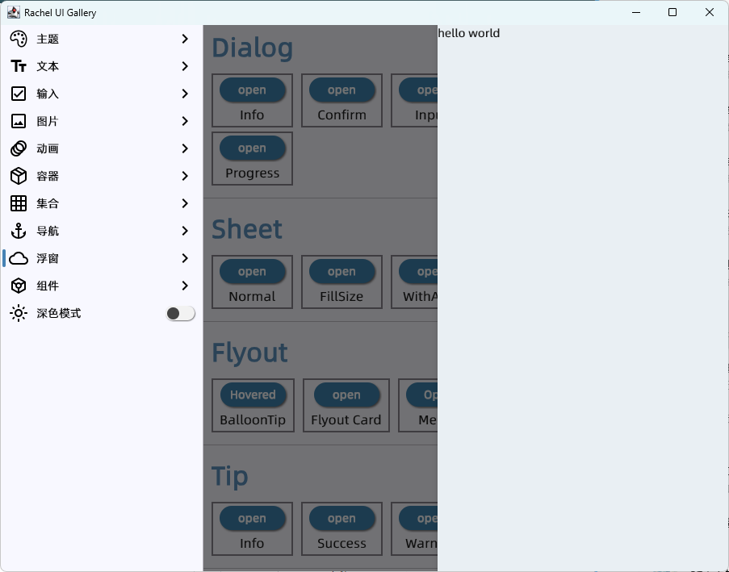

<div>
    <h5></h5>
    <div>
        
        
        
        
        
        
    </div>
    <h5></h5>
    <div>
        
        
        
        
    </div>
    <h5></h5>
</div>

### 语言 (Language) :
**中文** | [English](README_en.md)

# Rachel快速开发框架

`Rachel`是基于`Kotlin Multiplatform`与`Compose Multiplatform`集成逻辑、服务、UI的跨平台快速开发框架，由银临茶舍项目组完成开发。

涵盖跨平台入口、共享UI、依赖服务启动、客户端和服务端交互引擎、自由屏幕导航、平台原生组件、自定义主题、响应式布局、MDI配置一致性、分页加载、服务端路由等领域。

支持`Android`，`iOS`, `Windows`, `Linux`, `macOS`, `Web(Wasm)`等客户端, `Server`服务端。

## 特性

- **跨平台**：基于`KMP` / `CMP`，支持六个平台客户端与服务端，具有多端一致性。
- **原生性能**：生成平台原生二进制文件，无桥接或附加库。
- **单一语言**：仅需掌握`kotlin`语言即可完成大多数任务需求与开发。
- **快速**：三分钟便能上手构建自己的跨平台应用程序。
- **简洁**：大量类型安全与结构化的框架DSL，无需编写过多样板代码。
- **模块化**：全框架模块化，模块间依赖清晰，应用程序按需引入模块。
- **高协作**：框架支持前后端协作开发，共享数据组织结构。

# 文档
因为Rachel框架模块较多，功能丰富，一个最简单的应用程序可以仅导入app模块（注意版本号）：
```kotlin
implementation("love.yinlin.compose:app:x.x.x")
```

## 入门指引文档: [Rachel框架开发向导](https://rachel-ylcs.github.io/ylcs-kmp)

## API文档: [模块API合集](https://rachel-ylcs.github.io/ylcs-kmp/overrides/dokka)

# Rachel Compose UI 界面库

界面库涵盖主题、文本、输入、图片、动画、容器、集合、导航、浮窗等多种组件，支持暗色模式，界面库独立，无 `compose.material` 依赖。

## UI 在线预览: [Rachel UI Gallery](https://rachel-ylcs.github.io/ylcs-kmp/overrides/gallery)

|                       Theme                        |                     Dark Mode                      |
|:--------------------------------------------------:|:--------------------------------------------------:|
|       |        |
|                        Text                        |                      RichText                      |
|       |       |
|                       Button                       |                       Input                        |
|      |      |
|                        Icon                        |                       Image                        |
|      |      |
|                     Container                      |                   Data Container                   |
|  |  |
|                     Collection                     |                      Calendar                      |
|  |    |
|                     Animation                      |                     Navigation                     |
|   |  |
|                       Dialog                       |                       Sheet                        |
|      |       |
|                       Flyout                       |                        Tip                         |
|      |         |

# 案例：银临茶舍跨平台 App

> [!IMPORTANT]
>
>  基于`Rachel`框架开发的集资讯、听歌、美图、论坛、社交于一体的小银子聚集地应用程序
> 
>  银临茶舍水群：`828049503`


### 构建艺术


基于本案例，你可以学习到除了 `Rachel` 框架、`Rachel` 界面库外，更多 `KMP` 在架构设计、跨平台兼容等方面上有趣的实现，包括但不限于如下：

- 多模块、多APP的数据共享、结构共享
- 基于 Screen 的单一数据源的开发模式
- 多窗口、悬浮窗口的黑盒接口
- 音视频、多媒体、WebView 的跨平台实现
- 基于 Canvas 自绘的简单游戏引擎

## 贡献者

[](https://github.com/rachel-ylcs/ylcs-kmp/graphs/contributors)

## 许可

`银临茶舍` 是在 MIT 许可下许可的开源软件，查看[LICENSE](LICENSE)获取更多信息。

## 致谢

按首字母排序。

|  Type   |     Author      |                                                                                Name                                                                                |
|:-------:|:---------------:|:------------------------------------------------------------------------------------------------------------------------------------------------------------------:|
| Library | alexzhirkevich  |                             [compottie](https://github.com/alexzhirkevich/compottie), [qrose](https://github.com/alexzhirkevich/qrose)                             |
| Library | brettwooldridge |                                                      [HikariCP](https://github.com/brettwooldridge/HikariCP)                                                       |
| Library |    Calvin-LL    |                                                      [reorderable](https://github.com/Calvin-LL/Reorderable)                                                       |
| Library |   chrisbanes    |                                                             [haze](https://github.com/chrisbanes/haze)                                                             |
| Library |    fleeksoft    |                                                            [ksoup](https://github.com/fleeksoft/ksoup)                                                             |
| Library |     Google      |                                                            [media3](https://github.com/androidx/media)                                                             |
| Library |    jenly1314    |                            [zxing-lite](https://github.com/jenly1314/ZXingLite), [camera-scan](https://github.com/jenly1314/CameraScan)                            |
| Library |    Jetbrains    | [kotlin](https://github.com/JetBrains/kotlin), [compose-multiplatform](https://github.com/JetBrains/compose-multiplatform), [ktor](https://github.com/ktorio/ktor) |
| Library |     mlabbe      |                                                   [nativefiledialog](https://github.com/mlabbe/nativefiledialog)                                                   |
| Library |      mysql      |                                                                   [mysql](https://dev.mysql.com)                                                                   |
| Library |      panpf      |                                                             [sketch](https://github.com/panpf/sketch)                                                              |
| Library |     qos-ch      |                                                            [logback](https://github.com/qos-ch/logback)                                                            |
| Library |      redis      |                                                              [jedis](https://github.com/redis/jedis)                                                               |
| Library |     Tencent     |                                        [MMKV](https://github.com/Tencent/MMKV), [libpag](https://github.com/Tencent/libpag)                                        |