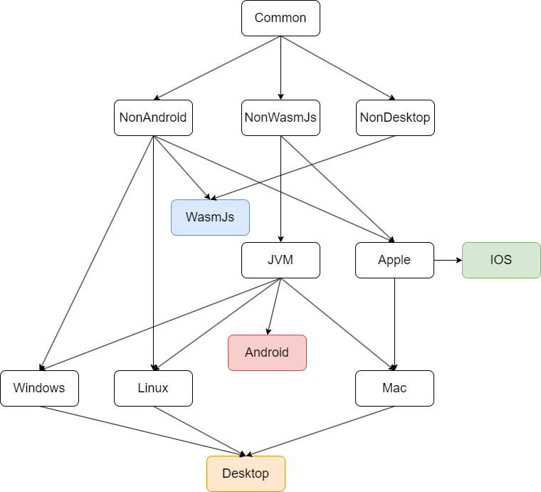

<div>
    <h1 align="center">银临茶舍跨平台 App</h1>
    <h5></h5>
    <div>
        
        
        
        
        
        
    </div>
    <h5></h5>
    <div>
        
        
        
        
        
    </div>
    <h5></h5>
</div>

> [!IMPORTANT]
>
>  集资讯、听歌、美图、论坛、社交于一体的小银子聚集地 茶舍水群：828049503

## 模块表

`M*: Module Level`  `D: Description`  `P: Multiplatform Supported`

|      M0       |       M1        |          M2           |                      D                       | P |
|:-------------:|:---------------:|:---------------------:|:--------------------------------------------:|:-:|
|  `ylcs-core`  |                 |                       |                                              |   |
|               |     `base`      |                       |                language core                 | ✅ |
|               | `compose-base`  |                       |                 compose core                 | ✅ |
|               |    `cs-base`    |                       |                   C/S core                   | ✅ |
| `ylcs-module` |                 |                       |                                              |   |
|               |    `compose`    |                       |                                              |   |
|               |                 |         `app`         |     fast and easy compose app framework      | ✅ |
|               |                 |       `screen`        |     screen page, floating and navigation     | ✅ |
|               |                 |       `context`       |      multiplatform application context       | ✅ |
|               |                 |       `device`        | adaptive device layout and immersive padding | ✅ |
|               |                 |        `theme`        |        app theme resources definition        | ✅ |
|               |                 |         `ui`          | custom theme and basic component definition  | ✅ |
|               |                 |    `component-all`    |           merge all component libs           | ✅ |
|               |                 | `component:url-image` |        web or local file image loader        | ✅ |
|               |    `startup`    |                       |                                              |   |
|               |                 |        `base`         |     common application startup services      | ✅ |
|               |      `os`       |                       |    system platform related implementation    | ✅ |
|               | `client-engine` |                       |                client engine                 | ✅ |
|               | `server-engine` |                       |                server engine                 | ❌ |
|  `ylcs-app`   |                 |                       |                                              |   |
|               |      `cs`       |                       |                  C/S bridge                  | ✅ |
|               |      `mod`      |                       |                   song MOD                   | ✅ |
|               |      `app`      |                       |                rachel client                 | ✅ |
|               |    `server`     |                       |                rachel server                 | ❌ |
|               |  `mod-manager`  |                       |               song MOD mangaer               | ❌ |
|  `ylcs-test`  |                 |                       |               test and feature               | ✅ |

## 源代码集依赖



## 部署

### 环境

#### Common
- gradle 8.14.3-all
- JDK 21
#### Android
- IntelliJ IDEA 2025.3
#### iOS
- Xcode 16.3
#### Windows
- MSVC v145
- Windows 10 / 11 SDK
#### Linux
- g++ 13
#### Server
- JDK 21

### 编译

#### Common

git clone 源代码，Gradle 同步，等待下载依赖，完成构建。

所有模块输出均在 `output` 目录中。

#### Android

所属模块： `ylcs-app:app`

- 运行：`AndroidRun`
- 发布签名安装包：`androidPublish`

#### IOS

所属模块： `ylcs-app:app`

首先进入 iosApp 目录，执行 `pod install` 安装依赖。 然后使用 Xcode 直接运行或发布。

#### Desktop

先进入 native 目录，执行 `build.bat`(Windows) 或 `build.sh`(Linux/macOS) 脚本，会自动生成动态链接库文件到 native/libs 目录。

所属模块： `ylcs-app:app`

- 运行(Debug)：`desktopRunDebug`
- 运行(Release)：`desktopRunRelease`
- 输出依赖树：`dependencies`
- 检查模块完整性：`desktopCheckModules`
- 发布可执行文件：`desktopPublish`

#### Web

所属模块： `ylcs-app:app`

- 浏览器运行：`webRun`
- 发布网页：`webPublish`

#### Server

构建后运行会自动部署，将初始目录复制到当前目录下，可以直接运行或发布。

所属模块： `ylcs-app:server`

- 运行： `ServerDebug`
- 发布可执行文件：`serverPublish`

#### 分离环境

Redis 和 MySQL 配置可在 `resources` 中的 `config.properties` 配置
可选择本地调试（连接备用服务器）或生产环境部署（连接 `localhost`）

#### 更新

服务器 `resources` 下的如 `server.json` 类的文件只是初始配置文件，
当有变更时手动更新服务器文件，重启服务器即可，无需重新编译服务器代码。

**即每次更新只需要更换服务器 JAR 文件重启即可**

## 自研轻量级 C/S 数据共享框架

### 接口定义

所有 C/S 交互接口均定义在 `shared` 模块的 `love.yinlin.api.API` 类中

借助 Kotlin 超强的 DSL 能力，提供完美的框架语法糖

### 服务端资源引用 ServerRes

```kotlin
// 示例
object ServerRes : ResNode("public") {
    object Activity : ResNode(this, "activity") {
        fun activity(uniqueId: String) = ResNode(this, "${uniqueId}.webp")
    }

    object Assets : ResNode(this, "assets") {
        val DefaultAvatar = ResNode(this, "default_avatar.webp")

        val DefaultWall = ResNode(this, "default_wall.webp")
    }

    object Users : ResNode(this, "users") {
        class User(uid: Int) : ResNode(this, "$uid") {
            val avatar = ResNode(this, "avatar.webp")

            val wall = ResNode(this, "wall.webp")

            inner class Pics : ResNode(this, "pics") {
                fun pic(uniqueId: String) = ResNode(this, "${uniqueId}.webp")
            }
        }
    }

    val Server = ResNode(this, "server.json")
    val Update = ResNode(this, "update.json")
    val Photo = ResNode(this, "photo.json")
}

```

服务端配置或公共文件的配置信息可以按树状object层级依次写出。

路径只需要提供名称，而不需要像其他框架般补全完整路径。

**例 1** 访问 UID 为 8 的用户的头像
```kotlin
ServerRes.Users.User(8).avatar
```

**例 2** 访问 UID 为 8 的用户的图片(图片 ID 是 123)
```kotlin
ServerRes.Users.User(8).Pics().pic(123)
```

### C/S 接口

C/S 接口的定义与数据模型在客户端（Android / iOS / Desktop / Web）与服务端中共享。

#### 公共接口

```kotlin

object API : APINode(null, "") {
    object User : APINode(this, "user") {
        object Profile : APINode(this, "profile") {
            object GetProfile : APIPost<String, UserProfile>(this, "getProfile")

            object GetPublicProfile : APIPost<Int, UserPublicProfile>(this, "getPublicProfile")

            object UpdateName : APIPostRequest<UpdateName.Request>(this, "updateName") {
                @Serializable
                data class Request(val token: String, val name: String)
            }

            object UpdateAvatar : APIFormRequest<String, UpdateAvatar.Files>(this, "updateAvatar") {
                @Serializable
                data class Files(val avatar: APIFile)
            }

            object Signin : APIPostRequest<String>(this, "signin")
        }

        object Topic : APINode(this, "topic") {
            object GetTopics : APIPost<GetTopics.Request, List<love.yinlin.data.rachel.Topic>>(this, "getTopics") {
                @Serializable
                data class Request(val uid: Int, val isTop: Boolean = true, val offset: Int = Int.MAX_VALUE, val num: Int = APIConfig.MIN_PAGE_NUM)
            }

            object SendTopic : APIForm<SendTopic.Request, SendTopic.Response, SendTopic.Files>(this, "sendTopic") {
                @Serializable
                data class Request(val token: String, val title: String, val content: String, val section: Int)
                @Serializable
                data class Files(val pics: APIFiles)
                @Serializable
                data class Response(val tid: Int, val pic: String?)
            }
        }
    }
}

```

与 ServerRes 相同，接口定义也是以树状层级写出。

接口路径不需要全写，只需在对应路径内填写名称。

路径中目录定义 object 继承自 APINode，接口定义 object 继承自 APIRoute

其中为方便简写，在三种方式（Get / Post / Form）与三种结构（自定义 Request 与 Response，简单 Request，简单 Response）中自由组合。

形成数十种别名，如 APIGetRequest，APIPostForm 等。

对于无 Body 的 Request，可以省略 Request 泛型即使用 APIResponse。

对简单 Request 可以直接使用 Int、String 作为 Reques t泛型，Response 同理。

复杂 Request 或 Response 可在 object 内自定义结构并声明 `@Serializable` 序列化。

数据模型可附带默认值。

#### 服务端

在 ServerAPI 中定义

```kotlin

api(API.User.Topic.SendTopic) { (token, title, content, section), (pics) ->
    VN.throwEmpty(title, content)
    VN.throwSection(section)
    val ngp = NineGridProcessor(pics)
    val uid = AN.throwExpireToken(token)
    val privilege = DB.throwGetUser(uid, "privilege")["privilege"].Int
    if (!UserPrivilege.topic(privilege) ||
        (section == Comment.Section.NOTIFICATION && !UserPrivilege.vipTopic(privilege)))
        return@api "无权限".failedData
    val tid = DB.throwInsertSQLGeneratedKey("""
         INSERT INTO topic(uid, title, content, pics, section, rawSection) VALUES(?, ?, ?, ?, ?, ?)
     """, uid, title, content, ngp.jsonString, section, section).toInt()
    // 复制主题图片
    val userPics = ServerRes.Users.User(uid).Pics()
    val pic = ngp.copy { userPics.pic(it) }
    Data.Success(API.User.Topic.SendTopic.Response(tid, pic), "发表成功")
}

```

使用 api 函数可直接引用公共接口的路径 object 作为参数，其参数，Body，表单的文件均自动识别名称及类型。

编译期泛型能保证所有的接口数据传递均是类型安全的，如果任何一个参数不匹配在编译前就会报错。

#### 客户端

在 ClientAPI 中定义

```kotlin

val result = ClientAPI.request(
    route = API.User.Mail.GetMails,
    data = API.User.Mail.GetMails.Request(
        token = config.userToken,
        offset = offset
    )
)

```

客户端可直接使用 request 函数并引用公共接口的路径 object，其参数，data 等均自动识别名称及类型。

且接受服务器的响应 result 也与公共接口中定义的完全一致，自动识别响应数据模型。

编译期泛型能保证所有的接口数据传递均是类型安全的，如果任何一个参数不匹配在编译前就会报错。

## Music模组协议

### MOD 核心模块 music

与 MOD 相关的模块为 music 和 modManager

music 模块是应用 MOD 存储协议及序列化与反序列化的核心实现, 被多平台客户端和 MOD 管理器调用

具体协议可参看 [Music 模组协议文档](docs/markdown/music.md)

### MOD 管理器 modManager

MOD 管理器是方便桌面客户端创建, 解析, 预览 MOD 的简易工具


## 贡献者

[](https://github.com/rachel-ylcs/ylcs-kmp/graphs/contributors)

## 许可

`银临茶舍KMP` 是在 MIT 许可下许可的开源软件，查看[LICENSE](LICENSE)获取更多信息。

## 致谢

按作者首字母排序。

|  Type   |     Author      |                                    Name                                     |
|:-------:|:---------------:|:---------------------------------------------------------------------------:|
| Library | alexzhirkevich  |          [compottie](https://github.com/alexzhirkevich/compottie)           |
| Library | alexzhirkevich  |              [qrose](https://github.com/alexzhirkevich/qrose)               |
| Library | brettwooldridge |           [HikariCP](https://github.com/brettwooldridge/HikariCP)           |
| Library |    Calvin-LL    |           [reorderable](https://github.com/Calvin-LL/Reorderable)           |
| Library |     caprica     |                   [vlcj](https://github.com/caprica/vlcj)                   |
| Library |   chrisbanes    |                 [haze](https://github.com/chrisbanes/haze)                  |
| Library |    fleeksoft    |                 [ksoup](https://github.com/fleeksoft/ksoup)                 |
| Library |     Google      |                 [media3](https://github.com/androidx/media)                 |
| Library |    jenly1314    |            [zxing-lite](https://github.com/jenly1314/ZXingLite)             |
| Library |    jenly1314    |           [camera-scan](https://github.com/jenly1314/CameraScan)            |
| Library |    Jetbrains    |                [kotlin](https://github.com/JetBrains/kotlin)                |
| Library |    Jetbrains    | [compose-multiplatform](https://github.com/JetBrains/compose-multiplatform) |
| Library |    Jetbrains    |                   [ktor](https://github.com/ktorio/ktor)                    |
| Library |      mysql      |                       [mysql](https://dev.mysql.com)                        |
| Library |      panpf      |                  [sketch](https://github.com/panpf/sketch)                  |
| Library |     qos-ch      |                [logback](https://github.com/qos-ch/logback)                 |
| Library |      redis      |                   [jedis](https://github.com/redis/jedis)                   |
| Library |     Tencent     |                   [MMKV](https://github.com/Tencent/MMKV)                   |
| Library |     Tencent     |                 [libpag](https://github.com/Tencent/libpag)                 |